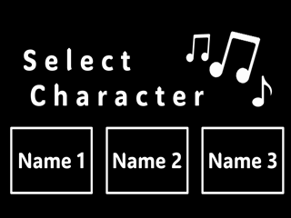
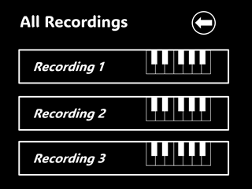
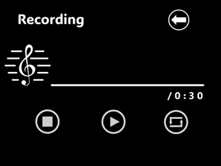
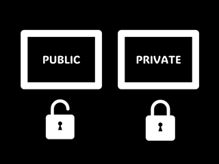

# Music Maker

**Music Maker** is a Verilog-based project implemented on an FPGA board that allows users to create, record, and play back music. The system features a user-friendly VGA display interface and supports multiple users with private and public song storage options. This project showcases advanced digital design skills, including finite state machine development and hardware interfacing.

## Table of Contents

- [Introduction](#introduction)
- [Features](#features)
- [Project Architecture](#project-architecture)
- [User Interface and Controls](#user-interface-and-controls)
- [Screenshots](#screenshots)
- [Implementation Details](#implementation-details)
- [License](#license)

## Introduction

The **Music Maker** project enables users to compose music by recording key presses from a keyboard connected to an FPGA board. Users can store their compositions in memory and play them back as desired. The project supports multiple users, each with their own song storage slots, and provides the option to set songs as private or public.

## Features

- **Multi-User Support**: Up to three users can save and access their songs.
- **Song Recording and Playback**: Record songs up to 20 seconds long and play them back.
- **Private and Public Storage**: Set songs as private or public to control access.
- **VGA Display Interface**: Real-time visual feedback on an attached VGA display.
- **Finite State Machine Control**: Smooth transitions between recording, storage, and playback states.
- **Keyboard Input**: Use a standard keyboard to input musical notes.

## Project Architecture

The project is structured around a finite state machine (FSM) that manages the different operational modes:

1. **User Selection Screen (Screen 1)**: Users select their profile.
2. **Song Storage Selection (Screen 2)**: Users choose a storage slot.
3. **Privacy Setting (Screen 3)**: Users set the selected slot as public or private.
4. **Recording and Playback (Screen 4)**: Users record their song and can play it back.

## User Interface and Controls

### Navigation Controls

- **Keyboard Keys 1, 2, 3**: Select options on screens (e.g., user profiles, storage slots).
- **FPGA Board Keys**:
  - **Key 0**: Start recording.
  - **Key 1**: Play back the recorded song.
  - **Key 2**: Return to the previous screen.
  - **Key 3**: Reset the system.

### Musical Input

- **Keyboard Letters**: Use the first seven letters (`A` to `G`) on the three rows of a QWERTY keyboard to input musical notes across three octaves.

### Screen Flow

1. **Screen 1 - User Selection**:

   - Displays three user names.
   - **Action**: Press `1`, `2`, or `3` to select a user.

2. **Screen 2 - Song Storage Slots**:

   - Displays three song storage slots for the selected user.
   - **Action**: Press `1`, `2`, or `3` to select a slot.

3. **Screen 3 - Privacy Setting**:

   - Option to set the song as public or private.
   - **Action**: Press `1` for public or `2` for private.

4. **Screen 4 - Recording and Playback**:
   - **Recording**:
     - Press **Key 0** on the FPGA to start recording.
     - For the next 20 seconds, press the letter keys (`A` to `G`) to input notes.
   - **Playback**:
     - Press **Key 1** on the FPGA to play back the recorded song.
   - **Navigation**:
     - Press **Key 2** to return to the previous screen.
     - Press **Key 3** to reset the system.

## Screenshots

_Note: Insert screenshots of the four screens in the appropriate sections below._

### Screen 1 - User Selection

### Screen 2 - Song Storage Slots

### Screen 3 - Privacy Setting

### Screen 4 - Recording and Playback

## Implementation Details

- **Verilog HDL**: The entire project is developed in Verilog Hardware Description Language.
- **Finite State Machine (FSM)**:
  - Manages states for user selection, song storage, privacy settings, recording, and playback.
  - Ensures smooth transitions and reliable operation.
- **VGA Display Interface**:
  - Provides real-time visual feedback to the user.
  - Displays menus, options, and recording status.
- **Memory Management**:
  - Utilizes onboard memory to store recorded songs.
  - Implements access control for private and public songs.
- **Keyboard Interface**:
  - Captures input from a standard keyboard connected to the FPGA.
  - Maps key presses to musical notes across three octaves.

## License

This project is licensed under the MIT License - see the [LICENSE](LICENSE) file for details.

---

**Note**: Remember to add your screenshots to the `screenshots/` directory and update the image paths accordingly.
